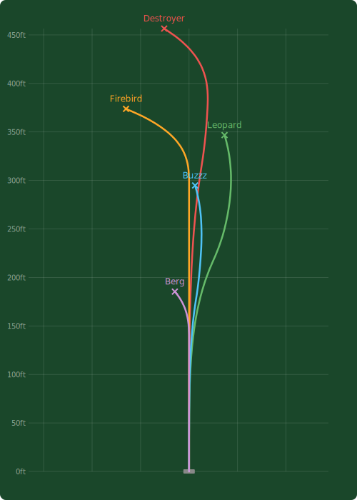

# disc-flight

Disc golf flight path visualization engine. Takes flight numbers (speed/glide/turn/fade) and outputs accurate, smooth flight path graphics.

Zero dependencies. Works in Node.js and the browser. Dual ESM + CJS builds.

<p align="center">
  
</p>

## Install

```bash
npm install disc-flight
```

## Usage

```typescript
import { calculateFlightPath, renderSvg } from 'disc-flight'

// Get raw coordinate data
const path = calculateFlightPath({
  speed: 12, glide: 5, turn: -1, fade: 3, // Destroyer
})
console.log(path.distance)     // ~457 (feet)
console.log(path.landingPoint) // { x: -28.7, y: 457 }
console.log(path.points)       // Array of { x, y } coordinates

// Render a single disc as SVG
const svg = renderSvg({
  speed: 12, glide: 5, turn: -1, fade: 3,
  color: '#ff4444',
  label: 'Destroyer',
})

// Compare multiple discs on one fairway
const comparison = renderSvg([
  { speed: 12, glide: 5, turn: -1, fade: 3, color: '#ff4444', label: 'Destroyer' },
  { speed: 5, glide: 4, turn: -1, fade: 1, color: '#44ff44', label: 'Buzzz' },
  { speed: 9, glide: 3, turn: 0, fade: 4, color: '#ff8800', label: 'Firebird' },
], { width: 500, height: 700 })
```

## API

### `calculateFlightPath(input: FlightInput): FlightPath`

Converts flight numbers to an array of coordinates.

**FlightInput:**
| Field | Type | Required | Description |
|-------|------|----------|-------------|
| `speed` | `number` | yes | 1-14, primary distance driver |
| `glide` | `number` | yes | 1-7, hang time / distance bonus |
| `turn` | `number` | yes | -5 to +1, high-speed lateral movement (negative = understable) |
| `fade` | `number` | yes | 0-5, low-speed hook at end of flight |
| `hand` | `string` | no | `'rhbh'` (default), `'lhbh'`, `'rhfh'`, `'lhfh'` |
| `armSpeed` | `string` | no | `'slow'`, `'normal'` (default), `'fast'` |
| `color` | `string` | no | SVG stroke color (for rendering) |
| `label` | `string` | no | Disc name label (for rendering) |
| `lineWidth` | `number` | no | SVG stroke width (default 2.5) |

**FlightPath:**
| Field | Type | Description |
|-------|------|-------------|
| `points` | `Point[]` | Array of `{ x, y }` coordinates (feet) |
| `distance` | `number` | Total flight distance in feet |
| `landingPoint` | `Point` | Final resting position |

### `renderSvg(discs, options?): string`

Renders one or more flight paths as an SVG string.

**RenderOptions:**
| Field | Type | Default | Description |
|-------|------|---------|-------------|
| `width` | `number` | 400 | SVG width in pixels |
| `height` | `number` | 600 | SVG height in pixels |
| `padding` | `number` | 40 | Inner padding |
| `showFairway` | `boolean` | true | Dark green background |
| `showLabels` | `boolean` | true | Disc name labels at landing |
| `showLandingZone` | `boolean` | true | X marks at landing positions |
| `showGrid` | `boolean` | false | Distance grid with labeled axes |

## How the Math Works

The flight model uses **velocity integration** rather than position-based phase transitions. This guarantees mathematically smooth curves with no kinks or bumps.

At each point in the flight, two lateral velocity components are calculated:

1. **Turn velocity** — models the high-speed lateral drift. Cubic rise (`t^3`) that accelerates from zero (disc looks straight off the tee), peaks around 55-67% of flight, then decays with a quadratic falloff as the disc slows.

2. **Fade velocity** — models the low-speed hook. Quadratic ease-in (`t^2`) compressed into the last ~20% of flight. Always accelerating — the curve gets steeper as the disc dumps speed, which matches how real discs behave.

These velocities are summed and integrated to produce the lateral position at each sample point. The "coast" period (where the disc drifts along its trajectory between turn and fade) emerges naturally from the velocity crossover — no explicit phase boundary needed.

**Key scaling decisions:**
- Turn/fade magnitudes use `abs(value)^1.5` so the response is non-linear: turn -1 is barely visible, turn -4 is dramatic
- Distance model outputs feet: putter ~185ft, mid ~295ft, fairway ~350ft, driver ~450ft
- Lateral displacement scales with distance so proportions stay realistic
- SVG renderer uses uniform X/Y scaling so a straight disc actually looks straight

The model was tuned by visual comparison against [DG Puttheads](https://dgputtheads.com) flight charts for benchmark discs: Destroyer (12/5/-1/3), Buzzz (5/4/-1/1), Firebird (9/3/0/4), Leopard (6/5/-2/1), and Berg (1/1/0/2).

## Handedness

All examples assume RHBH (right-hand backhand). The `hand` option mirrors the flight path:

- `'rhbh'` — right-hand backhand (default). Turn drifts right, fade hooks left.
- `'lhbh'` — left-hand backhand. Mirror of RHBH.
- `'rhfh'` — right-hand forehand. Same mirror as LHBH.
- `'lhfh'` — left-hand forehand. Same as RHBH.

## Arm Speed

The `armSpeed` modifier affects distance, turn, and fade:

- `'slow'` — 82% distance, 50% turn, 130% fade. Disc flies shorter and more overstable.
- `'normal'` — baseline. Manufacturer flight numbers as-is.
- `'fast'` — 110% distance, 140% turn, 80% fade. Disc flies farther and more understable.

## License

MIT
